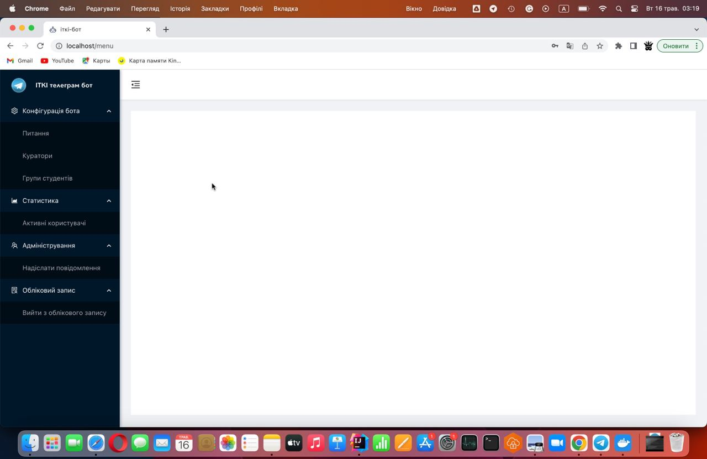

# itki-bot
## Description
This is a web application developed for NTU DP.
This app is created to support students and prospective students.
The app contains three services (excluding the database) in docker-compose:

- Java REST API
- Angular frontend
- Node-RED telegram bot

Admins can configure the Telegram bot using the Angular UI.
The Java API is responsible for authentication, data storage, and sending custom messages to Telegram.
The Node-RED bot utilizes data from the API to respond to users in Telegram.

This project supports:

- creating/deleting new questions from UI
- creating/deleting curators and student groups from UI
- monitoring telegram users from UI
- sending broadcast messages to telegram from UI
- getting information about rooms in NTU DP from telegram
- getting last FIT's schedule from telegram

Credentials for Angular UI and Node-RED:
* login is admin
* password is admin

## Screenshots
* Main window



* Node-RED


* Telegram


## How to run project

### Run optimized for server
In this way, you will have a project that works faster without the need to rebuild the frontend. However, the building process is slower compared to the second method.

#### How to run:
1) clone project
2) create .env file in source root. This file should have content from .env_sample (also you need setup variables with value '_')
3) build project with command: 
```shell
docker compose -f docker-compose.yml  build
```
or
```shell
make build
```
4) run project with command:
```shell
docker compose -f docker-compose.yml up
```
or
```shell
make up
```

4) go to the http://localhost/

In this way, you can stop the project in its current state using the command:

```shell
docker compose -f docker-compose.yml  stop
```
or
```shell
make stop
```

And you can stop the project by deleting the Docker containers. You can do this using the command:

```shell
docker compose -f docker-compose.yml down
```
or
```shell
make down
```

### Run optimized for developing
In this way, you will have the frontend rebuilt.

#### Requires:
- apache-maven-3.8.5
- Java version: 17.0.3.1
- npm-8.19.2

#### How to run:
1) clone project
2) create .env file in source root. This file should have content from .env_sample (also you need setup variables with value '_')
3) build Java API:
    1) go to the itki-bot-api folder
    2) run command:
```shell
./mvnw clean package
```
4) install dependencies for frontend with command:
    1) go to the frontend folder
    2) run command:
```shell
npm ci
```
5) run project with command: 
```shell
docker compose -f docker-compose-live-reload.yml up --build
```
or 
```shell
make up-live
```
6) go to the http://localhost:4200/
